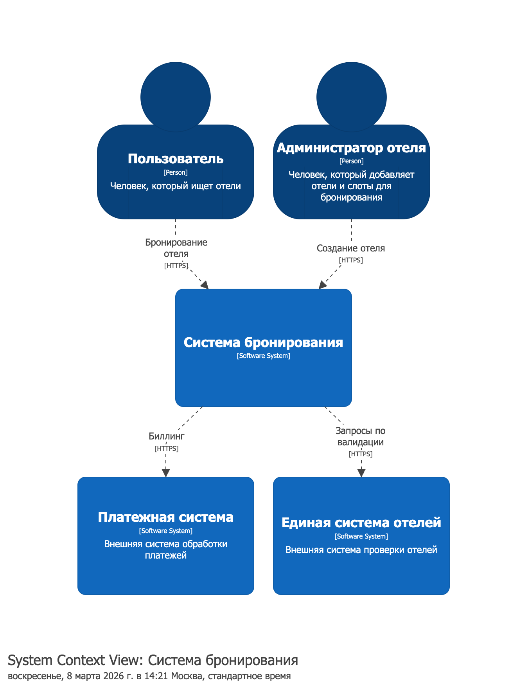
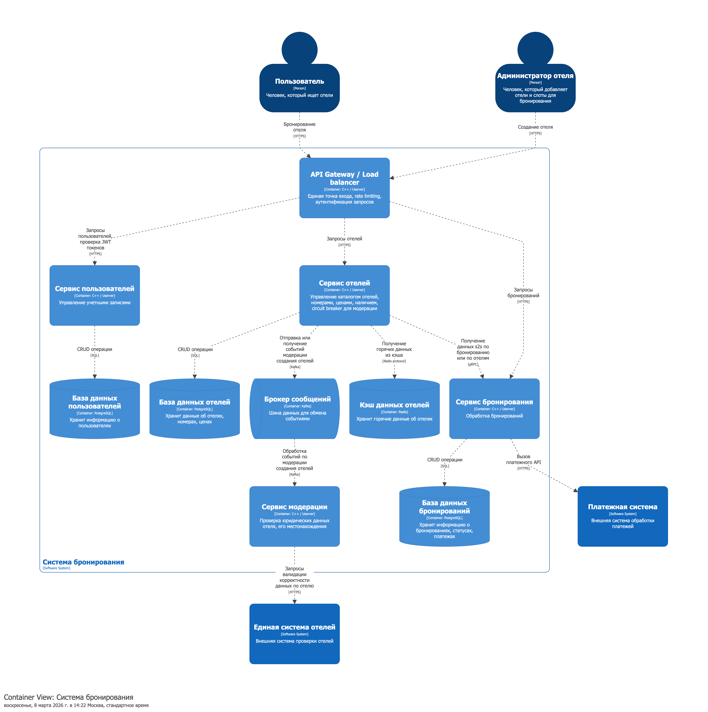
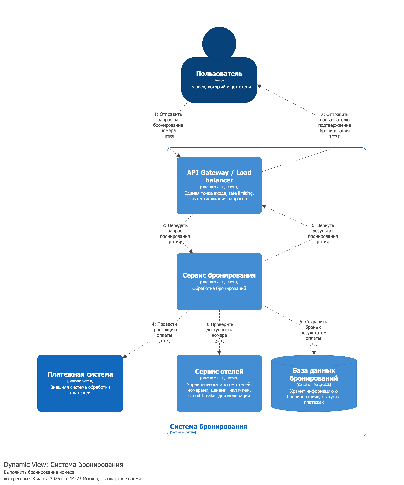
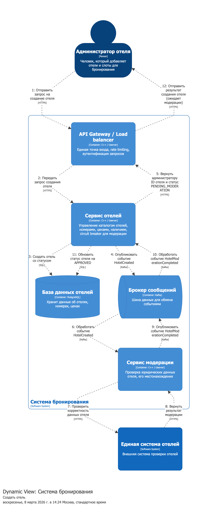

# Лабораторная работа №1 "Документирование архитектуры в Structurizr"

Рокотянский Александр, группа М8О‑102СВ‑25

## 1. Задание
Вариант 13. Система бронирования

## 2. Перечень ролей и внешних систем

Сервисом бронирования будут пользоваться две категории:

- отдыхающие, которые бронируют отели;
- администраторы отелей, которые добавляют отели и номера.

Для поддержки такого функционала используются две внешние системы:

- платёжная система, необходимая для проведения оплаты бронирований;
- внешняя система проверки отелей, которая, например, осуществляет проверку юридических данных по отелю и его статуса.

## 3. Диаграмма System Context

На контекстной диаграмме показаны основные акторы (пользователь и администратор), целевая система бронирования и две внешние системы, с которыми она взаимодействует.

## 4. Основные задачи пользователей

Исходя из описания задания и требований к функционалу, можно выделить три основные задачи пользователей в системе:

- создание нового пользователя (регистрация) — администратор и пользователь;
- создание отеля — администратор;
- бронирование номера — пользователь.

Для реализации этого core‑функционала системы потребуются базовые контейнеры, такие как веб‑приложения, API Gateway, а также база данных и кэш для горячих данных.

## 5. Перечень контейнеров

В системе используются три основных прикладных контейнера, реализующие функционал из предыдущего пункта:

- сервис пользователей;
- сервис отелей;
- сервис бронирования.

Помимо них, в модель включены инфраструктурные контейнеры: базы данных, кэш и брокер сообщений.

## 6. Взаимодействие между контейнерами

Используется следующий подход к взаимодействию:

- для первичных запросов с frontend через API Gateway к сервисам — протокол HTTPS;
- для межсервисного взаимодействия — gRPC;
- для работы с инфраструктурными контейнерами (БД, брокер сообщений и кэш) — SQL и протоколы Kafka/Redis соответственно.

## 7. Диаграмма контейнеров

Диаграмма контейнеров (C2) отражает основные сервисы системы бронирования, их связи между собой и используемыми хранилищами данных, кэшем и брокером сообщений.

Кроме самих сервисов и баз данных к ним, добавлены кэш и брокер сообщений как задел на будущее для последующих лабораторных работ (обработка событий, интеграция с другими системами и т.п.).

## 8. Перечень технологий

**Backend** — C++, Userver  
**Infra** — PostgreSQL, Kafka, Redis  
**Protocols** — HTTPS, gRPC, SQL, Kafka protocol, Redis protocol

## 9. Dynamic‑диаграммы

Dynamic‑диаграммы показывают последовательность взаимодействий между контейнерами для ключевых сценариев.

- **View 1** — процесс бронирования номера пользователем.

- **View 2** — процесс создания отеля администратором и его модерации.

